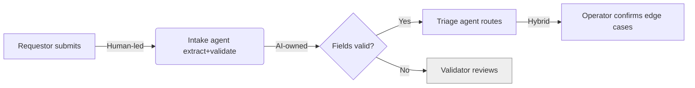

# Blueprint Templates (Phase 4 output)

Tag every task with **[AI-owned]**, **[Hybrid]**, or **[Human-led]**. Prefer a visual; when a
diagram isn't possible, use the swimlane text layout.

## Default swimlanes
- **Human:** Requestor / Operator / Approver
- **AI:** Agent(s) / Automation
- **Systems:** System of record / Data sources
- **Governance:** Validator / Workflow owner / Risk & compliance

## Swimlane text layout
```
STAGE 1: Intake
  Human    │ Requestor submits request (form)              [Human-led]
  AI       │ Intake agent extracts + validates fields      [AI-owned]
  Systems  │ Writes case to system of record
  Govern.  │ —  (exception → Validator if fields fail)

STAGE 2: Triage
  AI       │ Triage agent classifies + routes              [AI-owned]
  Human    │ Operator confirms edge cases                  [Hybrid]
  ...
```
Show, per stage: what the **agent** does, what the **human** does, what the **system of record**
does, and what happens on **exception**.

## Mermaid option (if diagrams render)


## Guardrails to attach to the blueprint
Quality checks · approval thresholds · audit trail · data boundaries · escalation paths.

## Optional role remapping
Suggest when relevant: **AI Workflow Owner · Output Validator · AI Supervisor · Prompt Architect.**
